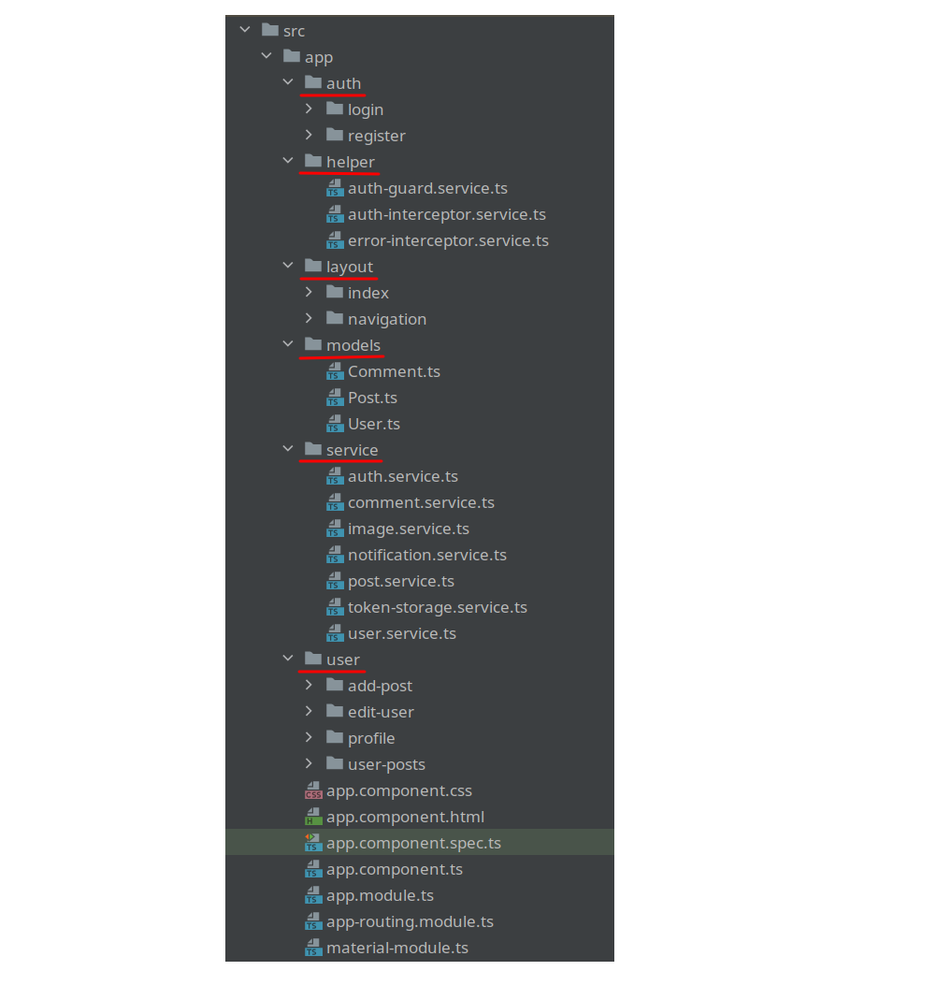

# Info

Учебная задача **Simple Instagram**.  
Проект состоит из репозиториев:
- [Backend](https://github.com/aleksey-nsk/simple_insta_backend)
- Frontend (данный репозиторий)

# Frontend

1. **Установить пакетный менеджер NPM**  

Обновить указатель локальных пакетов:  
`sudo apt update`  

Выполнить установку Node.js:  
`sudo apt install nodejs`

Убедиться что установка выполнена успешно, запросив у node номер версии:  
`node --version` => v12.22.9

Установить **npm (диспетчер пакетов Node.js)** с помощью apt:  
`sudo apt install npm`  
`npm --version` => 8.5.1  

2. **Компилятор TypeScript**

Установить компилятор TS с помощью команды менеджера пакетов npm:  
`sudo npm install -g typescript`

Если ранее уже был установлен TS, то его можно обновить до последней версии:  
`sudo npm update -g typescript`

Проверить версию:  
`tsc -v` => Version 4.9.4

3. **Пример компиляции приложения на TypeScript**

Создать каталог `example1`, и в нём создать файл `index.html` с содержимым:

    <!DOCTYPE html>
    <html>
    <head>
        <meta charset="utf-8" />
        <title>TypeScript example</title>
    </head>
    <body>
        <h2 id="header"></h2>
        
    </body>
    </html>

Это обычный html-файл, в котором определён пустой заголовок - элемент `<h2>`  
В него мы будем выводить некоторое содержимое.  
И также на веб-странице подключается файл `app.js`

Далее в том же каталоге создать файл **app.ts (файл кода TypeScrypt)** со следующим содержимым:  

    class User {
        name: string;
    
        constructor(_name: string) {
            this.name = _name;
        }
    }
    
    const tom: User = new User("Том");
    const header = this.document.getElementById("header");
    header.innerHTML = "Привет " + tom.name;

В этом коде сначала определяется `класс User` - шаблон данных, которые будут использоваться на  
веб-странице. Этот класс имеет `поле name`, которое представляет `тип string`, то есть строку. Для передачи
данных этому полю определён специальный метод - `constructor`, который принимает через  
`параметр _name` некоторую строку и передаёт её в `поле name`.

Далее создаём `константу tom`, которая представляет этот класс.
Затем получаем элемент с id `header` на веб-странице в одноименную константу `header`.
Далее с помощью `свойства innerHTML` меняем содержимое элемента.

В данном случае `свойству innerHTML` передаём строку, к которой добавляется значение
свойства `tom.name`. То есть мы ожидаем, что в заголовок на веб-странице
будет выводится создаваемая здесь строка.

Далее **скомпилируем этот файл в терминале**:  
`tsc app.ts`

После компиляции в каталоге проекта создаётся файл `app.js`, который будет выглядеть так:  

    var User = /** @class */ (function () {
        function User(_name) {
            this.name = _name;
        }
        return User;
    }());
    var tom = new User("Том");
    var header = this.document.getElementById("header");
    header.innerHTML = "Привет " + tom.name;

Далее откроем веб-страницу `index.html` в браузере и увидим заголовок **Привет Том**

4. **Установка Angular CLI**

Для компиляции приложения мы будем использовать инфрастуктуру **Angular CLI**.
Angular CLI упрощает создание приложения, его компиляцию.
Angular CLI распространяется как пакет npm, поэтому для его использования
его необходимо сначала установить.

Для установки Angular CLI выполнить в терминале следующую команду:

    # Установить версию Angular 10
    sudo npm install -g @angular/cli@10

Данная команда установит `пакет @angular/cli` в качестве глобального модуля, поэтому в дальнейшем 
при создании новых проектов Angular его не потребуется устанавливать заново.

Проверить версию CLI можно командой:  
`ng version`  
=> 

    Angular CLI: 10.2.1  
    Node: 12.22.9  
    OS: linux x64

5. **Создадим наше фронтенд-приложение**
   
Открыть в терминале папку `simple_insta`. Ввести команду для создания проекта  
с именем "simple-insta-frontend":  
`ng new simple-insta-frontend`

`? Would you like to add Angular routing? (y/N)` => y  
`? Which stylesheet format would you like to use?` => CSS  

В конце появились ошибки:  

    npm ERR! ERESOLVE unable to resolve dependency tree
    npm ERR! Found: jasmine-core@3.6.0
    npm ERR! peer jasmine-core@">=3.8" from karma-jasmine-html-reporter@1.7.0

Как их исправить: открыть в проекте файл `package.json` -> раздел `devDependencies` -> поменять  
версии на:  

    "jasmine-core": "~3.8.0",
    "karma-jasmine-html-reporter": "^1.7.0"

Далее открыть созданный проект в **Intellij IDEA** (теперь писать команды будем в терминале студии).

Добавляем **Angular Material** в приложение. Для этого идём на официальный сайт
https://material.angular.io/ -> Get started -> Install Angular Material:  
`ng add @angular/material`

Выбираю тему `Indigo/Pink`  
`? Set up global Angular Material typography styles? (y/N)` => y  
`? Set up browser animations for Angular Material? (Y/n)` => y  

Далее добавляем CSS с сайта **Bootstrap** (для того чтобы можно было создавать layout):  
https://getbootstrap.com/docs/5.0/getting-started/introduction/ -> _"Copy-paste the stylesheet `<link>` into
your `<head>` before all other stylesheets to load our CSS"_:  

    <link href="https://cdn.jsdelivr.net/npm/bootstrap@5.0.2/dist/css/bootstrap.min.css"
          rel="stylesheet"
          integrity="sha384-EVSTQN3/azprG1Anm3QDgpJLIm9Nao0Yz1ztcQTwFspd3yD65VohhpuuCOmLASjC"
          crossorigin="anonymous">

Открываем в проекте файл `src/index.html` и вставляем в _список тегов link_ в самое начало.

Далее **запускаем сервер**:  
`ng serve`  
=>

    ** Angular Live Development Server is listening on localhost:4200, open your browser on http://localhost:4200/ **
    : Compiled successfully.

Открываем в браузере адрес **localhost:4200** и видим дефолтную страницу Ангуляра.  
Где находится соответствующий template? -> `src/app/app.component.html`  
Нам этот template не понадобится. Полностью поменяем данный **html template**.
Очищаем всё содержимое данного файла и прописываем своё:

    <h1>Hello Angular</h1>

При этом в терминале видим, что **проект перекомпилировался**. В браузере на **localhost:4200** тоже всё
обновилось само: теперь тут заголовок **Hello Angular**.

6. Сначала создадим **модели** для нашего приложения
   
У нас будет 3 модели: **User**, **Post** и **Comment**.

7. Далее создадим **сервисы**, которые будут делать запросы на наш Backend

Создаём папку `src/app/service`. Далее генерируем сервисы используя CLI.  
Сгенерим сервис для авторизации:  
`ng generate service service/auth --skip-tests`

Затем остальные сервисы:  
`ng generate service service/comment --skip-tests`  
`ng generate service service/image --skip-tests`  

Сервис нотификации:  
`ng generate service service/notification --skip-tests`  

Сервис который будет получать посты с сервера:  
`ng generate service service/post --skip-tests`  

Сервис который будет сохранять токен, получаемый от бэкенда
(сохранять будет в локальной памяти браузера):  
`ng generate service service/token-storage --skip-tests`  
После чего мы будем использовать **Interceptor**, который будет каждый раз
подставлять этот токен с локальной памяти бруазера в **http-запрос**.

Юзер сервис:  
`ng generate service service/user --skip-tests`

Далее создадим папку `src/app/helper` и в ней создадим сервисы:     
`ng generate service helper/auth-guard --skip-tests`  
`ng generate service helper/auth-interceptor --skip-tests`  
`ng generate service helper/error-interceptor --skip-tests`  

8. Добавляем **Angular Material** для стиля приложения

9. **TokenStorage и Интерсепторы**

Сделаем авторизацию пользователя. Нам понадобится **сервис TokenStorageService**.
Сохранять токен будем в браузере.

**Сервис AuthInterceptorService** - это именно тот сервис, который каждый раз
будет подставлять токен в запросы.

10. Далее сервис с **нотификациями**: NotificationService

Сервис для загрузки картинок, сервис для комментариев, сервис авторизации и интерсептор ошибок.  
Последний сервис, который надо создать, это AuthGuardService.

11. **Компоненты**

_"Одним из ключевых элементов приложения являются компоненты. Компонент управляет 
отображением представления на экране."_

Сначала нужны 2 компонента: **Регистрация** и **Логин**.  
Создадим папку `src/app/auth` и в ней создадим наши 2 компонента:  
`ng generate component auth/register --skip-tests`  
`ng generate component auth/login --skip-tests`

Для проверки запустим сервер командой:  
`ng serve`  
и затем открываем в браузере http://localhost:4200/

Далее можем открыть:  
http://localhost:4200/register  
http://localhost:4200/login  

Далее создадим компоненты, определяющие куда юзер будет попадать после успешной аутентификации.  
Сначала создадим **компонент навигации**:  
`ng generate component layout/navigation --skip-tests`

Главная страница приложения: теперь создадим компоненту которая будет показывать все посты
для всех пользователей:  
`ng generate component layout/index --skip-tests`

Создадим страницу профиля пользователя:  
- там мы будем добавлять новые посты для своего профиля;  
- а также изменять данные юзера.

Создаём папку `src/app/user` и в ней уже создаём компоненты:  
`ng generate component user/profile --skip-tests`  
`ng generate component user/user-posts --skip-tests`  
`ng generate component user/edit-user --skip-tests`  
`ng generate component user/add-post --skip-tests`  
  
12. В конце структура каталога `src/app` выглядит так:  
    

13. Запущенное приложение в браузере выглядит так:  

**_Страница регистрации_**:  
  

**_Страница авторизации_**:  
  

**_Главная страница со списком всех постов_**:  
  

**_Профиль юзера_**:   
  
